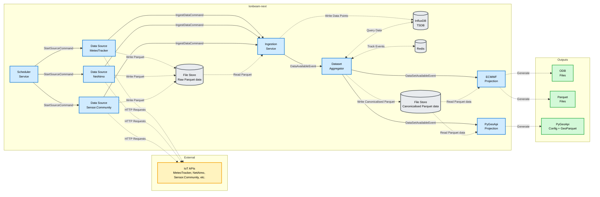

> [!WARNING]
> This project is ALPHA and will be experimental for the foreseeable future. Interfaces and functionality are likely to change. DO NOT use this software in any project/software that is operational.

<p align="center">
    
</p>

<p align="center">
    <em>⚡️ A library for IoT data wrangling ⚡️</em>
</p>

---

## What is IonBeam?

**IonBeam** is an event-driven platform for **stream-based processing of IoT observations**. It provides real-time collection, transformation, and distribution of environmental monitoring data from diverse IoT sources.

The platform implements a message-driven pipeline that:
- 🔗 Ingests observational data from multiple sources (REST APIs, MQTT brokers, file servers)
- 🔄 Transforms and validates observations using CF (Climate and Forecast) conventions
- 💾 Aggregates data into configurable time windows
- 📤 Exports processed data to multiple formats simultaneously (ODB, GeoParquet, APIs)

Built on event-sourcing principles, IonBeam captures incoming observations as immutable events, processed into specialized read models tailored to downstream use cases.

## Architecture




## Getting Started

Deploy the complete system using Docker Compose:

```bash
cd deployments/containers
docker compose up -d

# Access services:
# - RabbitMQ Management: http://localhost:15672 (guest/guest)
# - InfluxDB: http://localhost:8086 (admin/adminadmin)
# - PyGeoAPI EDR API: http://localhost:5000
# - Legacy API: http://localhost:8080
# - IonBeam Core Metrics: http://localhost:8000
```

This deployment includes:
- Infrastructure services (RabbitMQ, InfluxDB, Redis)
- IonBeam Core (ingestion, coordination, dataset building)
- Data sources (IonCannon, Acronet, Eumetnet, MeteoTracker, Sensor.Community)
- Exporters (ECMWF/ODB, PyGeoAPI, Legacy API)

## Configuration

Configuration files for the containers deployment are located in [`deployments/containers/config/`](deployments/containers/config/):
- [`ionbeam.yaml`](deployments/containers/config/) - Core service configuration
- Data source configs: `ioncannon.yaml`, `acronet.yaml`, `eumetnet.yaml`, `meteotracker.yaml`, `sensor_community.yaml`
- Exporter configs: `ecmwf-exporter.yaml`, `pygeoapi-exporter.yaml`, `pygeoapi-config.yaml`, `legacy-api.yaml`

Additional configuration examples are available in each component's directory:
- **Core service**: [`ionbeam/config.example.yaml`](ionbeam/config.example.yaml)
- **Data sources**: `data-sources/*/config.example.yaml`
- **Exporters**: `exporters/*/config.example.yaml`

