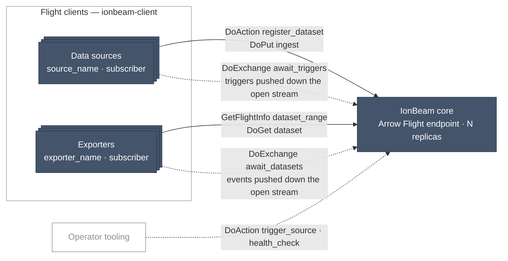

<p align="center">
  <a href="https://github.com/ecmwf/codex/raw/refs/heads/main/Project Maturity">
    
  </a>
  <a href="https://opensource.org/licenses/apache-2-0">
    
  </a>
</p>

<p align="center">
  <a href="#quick-start">Quick Start</a>
  •
  <a href="#architecture">Architecture</a>
  •
  <a href="#writing-data-sources-and-exporters">Writing data sources and exporters</a>
  •
  <a href="#configuration">Configuration</a>
</p>

> [!IMPORTANT]
> This software is **Emerging** and subject to ECMWF's guidelines on [Software Maturity](https://github.com/ecmwf/codex/raw/refs/heads/main/Project%20Maturity).

**IonBeam** brings observations from IoT and other unconventional sources into meteorological workflows. Data sources send observations to the core service, which organises them into time windows and builds datasets for downstream use. Exporters retrieve those datasets and convert them to formats such as ECMWF ODB. All three component types communicate through Arrow Flight.

Data sources and exporters are separate services built with the shared `ionbeam-client` library. The repository includes integrations for networks such as MeteoTracker and Sensor.Community, together with an ODB exporter. Dataset declarations are not tied to one metadata convention; the bundled sources use CF (Climate and Forecast) semantics.

## Quick Start

IonBeam requires Python 3.12+ and [uv](https://docs.astral.sh/uv/). From the repository root:

```bash
uv sync --all-packages
uv run ionbeam -c ionbeam/config.local.yaml start
```

This starts the core with in-memory adapters and a local dataset directory. No external services are required. The Flight endpoint listens on `grpc://localhost:8815`, and metrics are served at `http://localhost:8000`.

To push synthetic observations through it, run the bundled load generator in a second shell:

```bash
uv run ioncannon -c data-sources/ioncannon/config.example.yaml
```

It ingests a time range whenever the core triggers it. Enable the `scheduler` section in the core config to fire triggers on a wall-clock schedule (see [ionbeam/config.example.yaml](ionbeam/config.example.yaml)), or publish one manually with the `trigger_source` Flight action.

## Architecture

IonBeam exposes a single Arrow Flight endpoint. Data sources send observations to this endpoint, while exporters retrieve completed datasets from it. Data sources and exporters are independently deployed clients of the core service. They also open long-lived `DoExchange` streams through which the core sends triggers and dataset notifications.

Solid arrows represent data transfer; dashed arrows represent control messages.


```mermaid
%%{init: {"flowchart": {"diagramPadding": 12, "nodeSpacing": 55, "rankSpacing": 110, "htmlLabels": true}}}%%
flowchart LR

subgraph CLIENTS["Flight clients — ionbeam-client"]
  SRC@{ shape: procs, label: "Data sources<br/>source_name · subscriber" }
  EXP@{ shape: procs, label: "Exporters<br/>exporter_name · subscriber" }
end

OPS["Operator tooling"]

CORE["IonBeam core<br/>Arrow Flight endpoint · N replicas"]

SRC -->|"DoAction register_dataset<br/>DoPut ingest"| CORE
SRC -.->|"DoExchange await_triggers<br/>triggers pushed down the open stream"| CORE
EXP -->|"GetFlightInfo dataset_range<br/>DoGet dataset"| CORE
EXP -.->|"DoExchange await_datasets<br/>events pushed down the open stream"| CORE
OPS -.->|"DoAction trigger_source · health_check"| CORE

classDef inside fill:#44546A,stroke:#2D3A50,color:#FFFFFF
classDef outside fill:transparent,stroke:#8A8F98,color:#8A8F98

class SRC,EXP,CORE inside
class OPS outside

style CLIENTS fill:transparent,stroke:#9AA0A6,stroke-width:1px
```

Valkey coordinates work across core, data-source, and exporter replicas:

- an atomic claim picks one scheduler replica to fire each trigger boundary
- replicas of a source or exporter share one event-stream consumer group and split the events between them
- builders lease due windows from a shared queue, so a crashed replica's work returns to the pool

Trigger and dataset-event delivery is at least once. Stable identifiers allow clients to handle redelivery without duplicating work. [docs/architecture.rst](docs/architecture.rst) describes the data flow, storage, and scaling model.

The repository is a [uv](https://docs.astral.sh/uv/) workspace:

- [ionbeam/](ionbeam/) — the core service and public Arrow Flight endpoint
- [ionbeam-client/](ionbeam-client/) — client library shared by data sources and exporters
- [data-sources/](data-sources/) — the bundled data sources: Flight clients that pull from external IoT APIs and push observations in
- [exporters/](exporters/) — the bundled exporters: Flight clients that subscribe to built datasets and write ODB

Deployment configurations (container stacks, Kubernetes chart) are maintained outside the repository and are not published yet.

## Writing data sources and exporters

New data sources and exporters use [ionbeam-client](ionbeam-client/). A source registers a dataset schema and streams Arrow RecordBatches with `client.ingest(...)`. It may run on its own schedule or respond to triggers from the core scheduler.

An exporter registers a handler for completed datasets. The [ionbeam-client README](ionbeam-client/README.md) provides working examples of both component types.

## Configuration

Each component reads a YAML configuration file, supplied with `-c` or through its configuration environment variable. The annotated [core example](ionbeam/config.example.yaml) covers the Flight endpoint, storage backends, scheduler windows, and dataset registry. Examples for data sources and exporters are stored beside their respective components and point `ionbeam.flight_url` at the core.

[ionbeam/config.local.yaml](ionbeam/config.local.yaml) provides a local configuration with in-memory adapters.

## Testing

```bash
uv run pytest
```

## Licence

```
Copyright 2025- European Centre for Medium-Range Weather Forecasts (ECMWF) and individual contributors.

Licensed under the Apache License, Version 2.0 (the "License");
you may not use this file except in compliance with the License.
You may obtain a copy of the License at

    http://www.apache.org/licenses/LICENSE-2.0

Unless required by applicable law or agreed to in writing, software
distributed under the License is distributed on an "AS IS" BASIS,
WITHOUT WARRANTIES OR CONDITIONS OF ANY KIND, either express or implied.
See the License for the specific language governing permissions and
limitations under the License.

In applying this licence, ECMWF does not waive the privileges and immunities
granted to it by virtue of its status as an intergovernmental organisation
nor does it submit to any jurisdiction.
```
