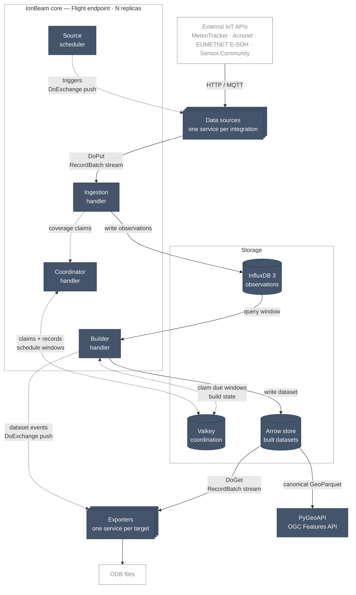

<p align="center">
  <a href="https://github.com/ecmwf/codex/raw/refs/heads/main/Project Maturity">
    
  </a>
  <a href="https://opensource.org/licenses/apache-2-0">
    
  </a>
</p>

<p align="center">
  <a href="#quick-start">Quick Start</a>
  •
  <a href="#architecture">Architecture</a>
  •
  <a href="#writing-data-sources-and-exporters">Writing data sources and exporters</a>
  •
  <a href="#configuration">Configuration</a>
</p>

> [!IMPORTANT]
> This software is **Emerging** and subject to ECMWF's guidelines on [Software Maturity](https://github.com/ecmwf/codex/raw/refs/heads/main/Project%20Maturity).

**IonBeam** is an orchestration system for bringing IoT and other unconventional observations into meteorological workflows. The core service schedules data sources, ingests the observations they push, tracks coverage of each time window, and builds time-windowed datasets, all served over Arrow Flight. Data sources and exporters run as separate Flight clients written with a shared client library, so new ones can be added without changes to the core, and each component can run with multiple replicas.

The bundled components form a meteorological pipeline: data sources that pull from IoT networks such as MeteoTracker and Sensor.Community, and exporters that write the built datasets onward as ECMWF ODB files. The schema itself is agnostic of any metadata convention; the bundled sources declare their variables with CF (Climate and Forecast) semantics, one of the governed vocabularies a declaration can use.

## Quick Start

IonBeam requires Python 3.12+ and [uv](https://docs.astral.sh/uv/). From the repository root:

```bash
uv sync --all-packages
uv run ionbeam -c ionbeam/config.local.yaml start
```

This starts the core with in-memory adapters and a local dataset directory, no external services required. The Flight endpoint listens on `grpc://localhost:8815`; metrics are served on `http://localhost:8000`.

To push synthetic observations through it, run the bundled load generator in a second shell:

```bash
uv run ioncannon -c data-sources/ioncannon/config.example.yaml
```

It ingests a time range whenever the core triggers it. Enable the `scheduler` section in the core config to fire triggers on a wall-clock schedule (see [ionbeam/config.example.yaml](ionbeam/config.example.yaml)), or publish one manually with the `trigger_source` Flight action.

## Architecture

Scheduling, ingestion, window coordination and dataset building all happen in the core service. Data sources and exporters connect as Arrow Flight clients and can be started, stopped and scaled independently of it. Solid arrows carry data; dashed arrows carry control events.


```mermaid
%%{init: {"flowchart": {"diagramPadding": 12, "nodeSpacing": 60, "rankSpacing": 70, "htmlLabels": true}}}%%
flowchart TB

EXT["External IoT APIs<br/>MeteoTracker · Acronet · EUMETNET E-SOH · Sensor.Community"]

SOURCES@{ shape: procs, label: "Data sources<br/>one service per integration" }

subgraph CORE["IonBeam core — Flight endpoint · N replicas"]
  SCHED["Source<br/>scheduler"]
  ING["Ingestion<br/>handler"]
  COORD["Coordinator<br/>handler"]
  BUILD["Builder<br/>handler"]
end

subgraph STORES["Storage"]
  INFLUX[("InfluxDB 3<br/>observations")]
  VALKEY[("Valkey<br/>coordination")]
  ARROW[("Arrow store<br/>built datasets")]
end

EXPORTERS@{ shape: procs, label: "Exporters<br/>one service per target" }
PYGEO["PyGeoAPI<br/>OGC Features API"]
OUTPUTS["ODB files"]

EXT -->|"HTTP / MQTT"| SOURCES
SCHED -.->|"triggers<br/>DoExchange push"| SOURCES
SOURCES -->|"DoPut<br/>RecordBatch stream"| ING
ING -->|"write observations"| INFLUX
ING -.->|"coverage claims"| COORD
COORD <-.->|"claims + records<br/>schedule windows"| VALKEY
BUILD <-.->|"claim due windows<br/>build state"| VALKEY
INFLUX -->|"query window"| BUILD
BUILD -->|"write dataset"| ARROW
BUILD -.->|"dataset events<br/>DoExchange push"| EXPORTERS
ARROW -->|"DoGet<br/>RecordBatch stream"| EXPORTERS
EXPORTERS --> OUTPUTS
ARROW -->|"canonical GeoParquet"| PYGEO

COORD ~~~ BUILD

classDef inside fill:#44546A,stroke:#2D3A50,color:#FFFFFF
classDef outside fill:transparent,stroke:#8A8F98,color:#8A8F98

class SOURCES,SCHED,ING,COORD,BUILD,EXPORTERS,PYGEO,INFLUX,VALKEY,ARROW inside
class EXT,OUTPUTS outside

style CORE fill:transparent,stroke:#9AA0A6,stroke-width:1px
style STORES fill:transparent,stroke:#9AA0A6,stroke-width:1px
```

Every service runs with any number of replicas, with coordination in Valkey:

- an atomic claim picks one scheduler replica to fire each trigger boundary
- replicas of a source or exporter share one event-stream consumer group and split the events between them
- builders lease due windows from a shared queue, so a crashed replica's work returns to the pool

Delivery is at-least-once end to end, with deterministic ids making retries idempotent. [docs/architecture.rst](docs/architecture.rst) covers the mechanisms.

The repository is a [uv](https://docs.astral.sh/uv/) workspace:

- [ionbeam/](ionbeam/) — the core service and public Arrow Flight endpoint
- [ionbeam-client/](ionbeam-client/) — client library shared by data sources and exporters
- [data-sources/](data-sources/) — the bundled data sources: Flight clients that pull from external IoT APIs and push observations in
- [exporters/](exporters/) — the bundled exporters: Flight clients that subscribe to built datasets and write ODB
- [ionbeam-legacy-api/](ionbeam-legacy-api/) — the previous public HTTP API, served unchanged from the new system

Deployment configurations (container stacks, Kubernetes chart) are maintained outside the repository and are not published yet.

## Writing data sources and exporters

New data sources and exporters are written with [ionbeam-client](ionbeam-client/). A source registers its dataset schema and streams Arrow RecordBatches into the core with `client.ingest(...)`, either on its own schedule or through a trigger handler driven by the core's scheduler. An exporter registers a handler that receives each built dataset as a stream of RecordBatches. The [ionbeam-client README](ionbeam-client/README.md) has working examples of both.

## Configuration

Each component reads one YAML file, passed with `-c` or via its config environment variable. Annotated examples live alongside each component: [ionbeam/config.example.yaml](ionbeam/config.example.yaml) (the core: Flight endpoint, storage backends, scheduler windows, dataset registry), `data-sources/*/config.example.yaml` and `exporters/*/config.example.yaml` (each points `ionbeam.flight_url` at the core). [ionbeam/config.local.yaml](ionbeam/config.local.yaml) is a ready-made local setup using in-memory adapters.

## Testing

```bash
uv run pytest
```

## Licence

```
Copyright 2025- European Centre for Medium-Range Weather Forecasts (ECMWF) and individual contributors.

Licensed under the Apache License, Version 2.0 (the "License");
you may not use this file except in compliance with the License.
You may obtain a copy of the License at

    http://www.apache.org/licenses/LICENSE-2.0

Unless required by applicable law or agreed to in writing, software
distributed under the License is distributed on an "AS IS" BASIS,
WITHOUT WARRANTIES OR CONDITIONS OF ANY KIND, either express or implied.
See the License for the specific language governing permissions and
limitations under the License.

In applying this licence, ECMWF does not waive the privileges and immunities
granted to it by virtue of its status as an intergovernmental organisation
nor does it submit to any jurisdiction.
```
